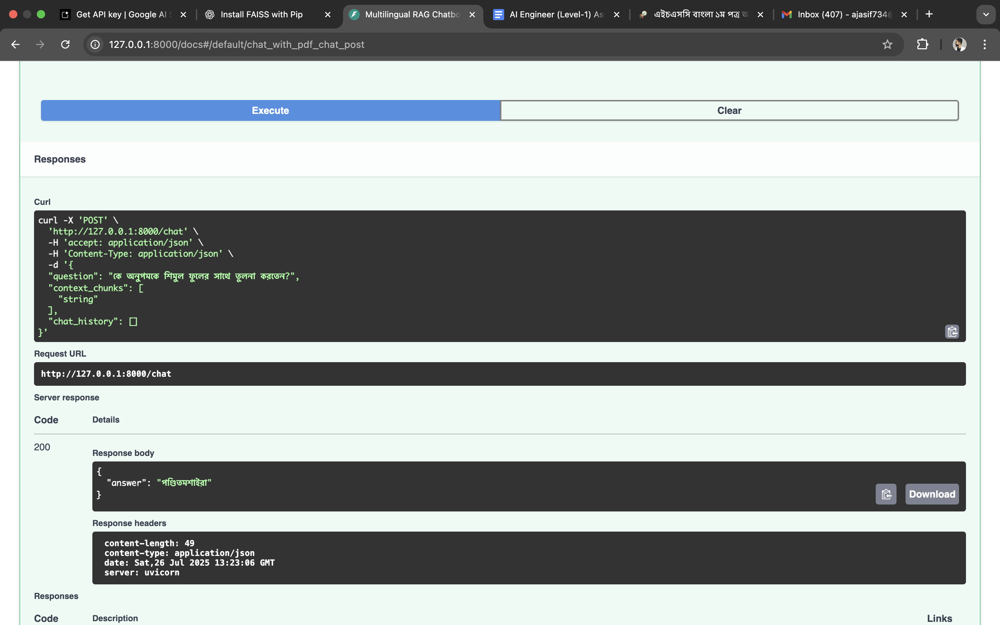
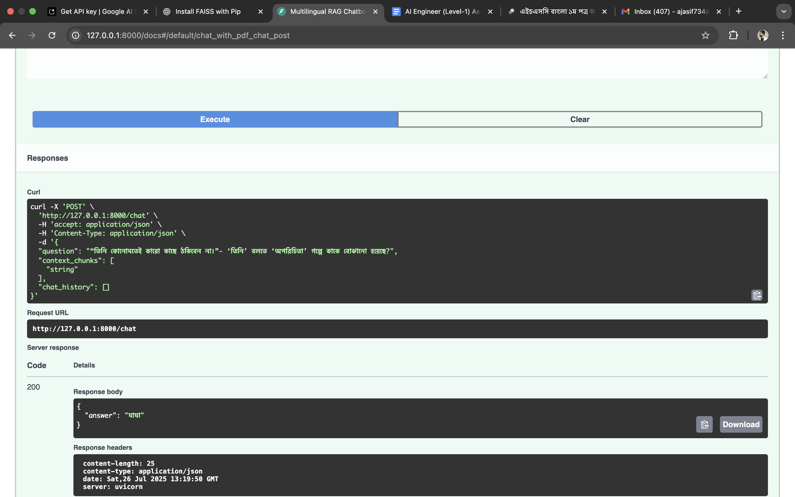

# Simple Multilingual RAG System
A multilingual Retrieval-Augmented Generation (RAG) system that can understand and respond to both English and Bengali queries using a Bangla PDF document as knowledge base (HSC26 Bangla 1st Paper).
Built as part of an AI Engineer (Level-1) technical assessment.

## 🧠 Objective
To design and implement a simple RAG system that:

Accepts user queries in English or Bangla

Retrieves relevant context chunks from a document corpus

Generates grounded and contextually accurate answers

Maintains both long-term and short-term memory for chat sessions

## 🏗️ System Architecture
### 1. 📄 Document Preprocessing
Input: HSC26 Bangla 1st Paper (PDF)

Cleaning steps: punctuation removal, normalization, spacing, etc.

Chunking: Divides cleaned text into overlapping chunks for better semantic retrieval

### 2. 🔍 Embedding and Vectorization
Embedding model used: paraphrase-multilingual-MiniLM-L12-v2 from SentenceTransformers

Vector database: FAISS (in-memory for simplicity)

Long-term memory: PDF chunks are vectorized and stored

Short-term memory: Maintains recent user queries and responses during session

### 3. 🧾 Query Flow
User submits a question (Bangla or English)

Embedding is generated for the query

FAISS retrieves top-k similar context chunks

Query + context is passed to a multilingual LLM (OpenAI, Gemini, or others)

Response is generated based on reasoning over retrieved text

## 🗣️ Prompt Engineering

rag_prompt = """
You are an advanced multilingual AI assistant...
(See `rag_prompt.py` for full prompt)
"""
Prompt ensures:

Answer in the same language as query

Emphasis on reasoning, not surface-level matching

Academic tone and accuracy

## ✅ Sample Test Cases
User Query (Bangla)	Expected Answer
অনুপমের ভাষায় সুপুরুষ কাকে বলা হয়েছে?	শুম্ভুনাথ
কাকে অনুপমের ভাগ্য দেবতা বলে উল্লেখ করা হয়েছে?	মামাকে
বিয়ের সময় কল্যাণীর প্রকৃত বয়স কত ছিল?	১৫ বছর

## 🧪 Evaluation
Evaluation metrics:

Cosine Similarity: Between query and context

Groundedness: Is the response based on retrieved text?

Relevance: How closely the chunks match the query intent?

Evaluation notebook: evaluation.py
You can run:

python evaluation.py


## 🧰 Dependencies

pip install -r requirements.txt
sentence-transformers

faiss-cpu or faiss-gpu

openai or google-generativeai

langchain (optional)

fastapi, uvicorn (for API)

## 🚀 Run the RAG Pipeline

python main.py
Or run the API:
uvicorn app.main:app --reload


Then query:
http://localhost:8000/ask?question= অনুপমের ভাষায় সুপুরুষ কাকে বলা হয়েছে?

## 📦 Project Structure

.
├── data/
│   ├── HSC26-Bangla1st-Paper.pdf
│   └── extracted_text_from_HSC26_Bangla1st-Paper.txt
├── core/
│   ├── config.py
├── scripts/
│   ├── vector_store.py
├── models/
│   ├── rag.py.py
├── services/
│   ├── embedding.py
│   ├── llm_generator.py
│   └── retriever.py
├── utils/
│   ├── cleaner.py
│   └── data_preprocess.py
├── main.py
├── app.py            # FastAPI app
├── rag_evaluation.py
├── rag_test.py
├── README.md
└── requirements.txt


## 🚀 Set up guide or How to Run the App

### 1. 📦 Clone the Repository

```bash
git clone https://github.com/Asif734/Multilingual-chatbot
cd Multilingual-chatbot
```

### 2. Set your .env file 
add "
``` bash
GEMINI_API_KEY=your_api_key
```

### 3. Install requirements
```bash
pip install -r requirements.txt
```

### 4. Dataset
Keep the text book at data folder.
Pass it to the cleaner.py file and run it and store output.txt at data folder for further use.

### 5. Start the app
```bash
uvicorn app.main:app --reload

```


## 🛠️ Tools & Technologies
SentenceTransformers – for multilingual text embeddings

FAISS – fast similarity search over vector data

FastAPI – backend API for querying and answering

Uvicorn – server to run FastAPI

easyocr – PDF text extraction

NumPy – array operations and embedding handling

Tqdm – progress tracking

Pickle – saving and loading index/data

GeminiAPI - As LLM model

Scikit-Learn - Evaluation matrcis


### Demo





## Answers of Given questions:
#### ❓ What method or library did you use to extract the text, and why? Did you face any formatting challenges with the PDF content?
I used EasyOCR to extract text from the PDF. This decision was made after testing other popular libraries like pdfplumber and PyMuPDF (fitz), which are commonly used for PDF text extraction.

However, both pdfplumber and fitz faced significant challenges when processing the document, especially due to the nature of the Bangla language content. These libraries often merged multiple words together, leading to loss of meaning, which seemed to be caused by Unicode rendering issues or non-standard text encoding in the original PDF.

In contrast, EasyOCR—being an optical character recognition (OCR) tool—reads text directly from the rendered image of the page, bypassing encoding issues. It provided more accurate word boundaries and better preserved the semantic structure of Bangla text, which was crucial for downstream semantic retrieval and RAG-based generation.

#### ❓ What chunking strategy did you choose (e.g. paragraph-based, sentence-based, character limit)? Why do you think it works well for semantic retrieval?
I chose a character limit-based chunking strategy, where the document is split into chunks of a fixed maximum number of characters.

Why this works well for semantic retrieval:

Consistent chunk size: Having uniform chunk sizes helps maintain balance between too small (losing context) and too large (diluting relevance) chunks.

Preserves context: Character limit chunks typically capture enough surrounding context for meaningful semantic understanding without cutting off mid-meaning as aggressively as sentence-only chunks might.

Language-agnostic: Unlike sentence-based splitting, which relies on proper sentence tokenization that can be tricky for some languages (e.g., Bengali), character limits work universally across languages and scripts.

Efficient indexing: Fixed-size chunks simplify embedding computation and storage, improving retrieval speed and consistency.

#### ❓ What embedding model did you use? Why did you choose it? How does it capture the meaning of the text?

I chose this model because it's a lightweight, multilingual sentence embedding model optimized for semantic similarity and retrieval tasks. Here’s why it fits well for your RAG system:

Multilingual Support
It supports over 50 languages, including English and Bangla, which is essential for your multilingual RAG assistant.

Paraphrase-Tuned
It’s trained specifically for paraphrase mining, which means it excels at capturing semantic similarity, not just surface-level word matching.

Efficient and Fast
Being based on MiniLM, it’s much smaller and faster than traditional transformer models, making it ideal for real-time inference in web APIs or chatbots.


Others models are there for semantic analysis but they are too big to handle by the system that i am using.


#### ❓ How are you comparing the query with your stored chunks? Why did you choose this similarity method and storage setup?
 compare the user query with stored document chunks by converting both the query and the chunks into dense vector embeddings using the same pre-trained language model. Then, I measure similarity between the query vector and each chunk vector using cosine similarity.

Why cosine similarity?

Measures semantic closeness: Cosine similarity captures how similar the direction of two vectors is in embedding space, which aligns well with semantic similarity rather than just raw keyword overlap.

Scale-invariant: It ignores vector magnitude differences, focusing on the angle between vectors, which is desirable because embedding magnitude can vary.

Widely used and efficient: It’s a standard, well-understood metric in NLP applications and can be computed very efficiently, especially with vector indexes.

Storage Setup:

The chunk embeddings are stored in a vector database or similarity index (e.g., FAISS, Annoy, or other approximate nearest neighbor libraries).

This enables fast retrieval of the top-k most similar chunks for any given query vector.


#### ❓ How do you ensure that the question and the document chunks are compared meaningfully? What would happen if the query is vague or missing context?
To ensure the question (query) and document chunks are compared meaningfully:

Use of Contextual Embeddings: Both the query and document chunks are converted into dense vector representations using the same pre-trained language model that captures semantic meaning, not just surface text. This means vectors reflect the underlying concepts, allowing meaningful similarity comparisons beyond exact words.

Consistent Preprocessing: Both query and chunks undergo similar preprocessing (like lowercasing, removing noise) to maintain consistency in embedding space.

Chunk Size and Overlap: By choosing chunk sizes that capture enough context, each chunk contains coherent, self-contained information, reducing the chance that relevant info is split across chunks.

Similarity Metric: Cosine similarity (or similar measures) captures semantic closeness, helping match even if wording differs.

#### ❓ Do the results seem relevant? If not, what might improve them (e.g. better chunking, better embedding model, larger document)?

The result seems quite similar. In some cases, it gives wrong output as many question's answer is not directly given at the passage. Semantic result is quite tough for llm.

##### Better Chunking Strategy:

Use semantic-aware chunking (e.g., paragraph-based or sentence-boundary-aware) instead of fixed character limits to ensure chunks contain coherent units of meaning.

Introduce overlapping chunks to reduce context loss at chunk boundaries.

##### Improved Embedding Model:

Upgrade to a more powerful or domain-specific embedding model that better understands the language nuances or subject matter.

Fine-tune the embedding model on your specific document corpus or task to capture more relevant semantic signals.

##### Larger or More Diverse Document Corpus:

Adding more documents or supplementary sources can provide richer information for retrieval and increase the chance of finding relevant content